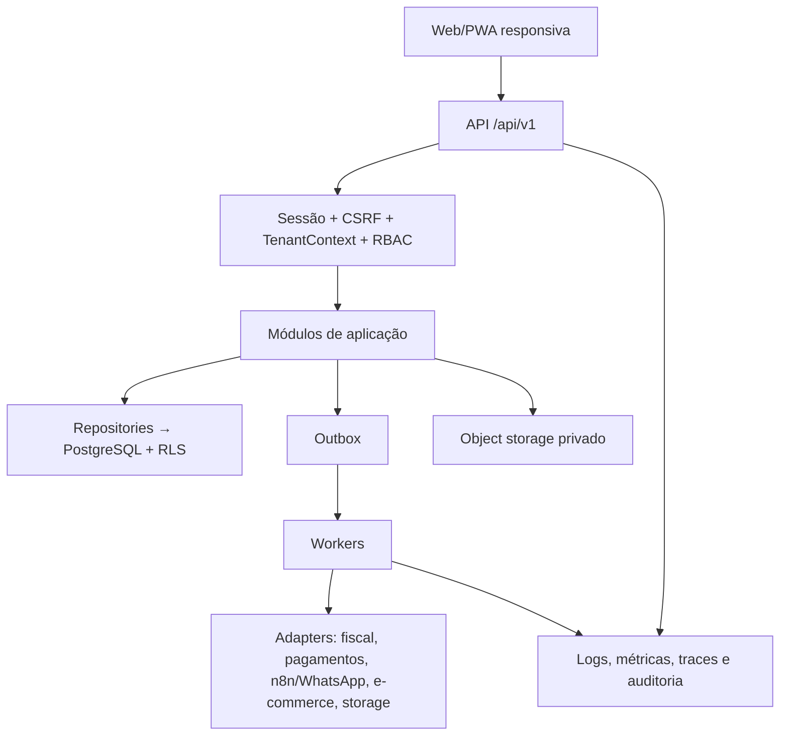

# Arquitetura do ERP Datwork

Status: **arquitetura alvo proposta**; inventário do estado atual baseado no repositório em 20/08/2026.

## Estado observado

| Região | Estado | Evidência/limite |
| --- | --- | --- |
| SPA | **Parcial** | React/Vite, rotas lazy, agenda, produtos, insumos, receitas, despesas e precificação |
| API | **Parcial** | Express, controllers/services/contracts/presenters e middleware básico |
| Banco | **Legado** | Prisma + SQLite, 23 migrations; valores financeiros ainda usam `Float` |
| Login | **Parcial/simulado** | tela existe; backend fecha produção e permite bypass apenas em desenvolvimento |
| SaaS multiempresa | **Proposto** | sem Organization/User/Membership/RBAC/RLS implementados |
| Assíncrono/integrações | **Proposto** | sem outbox, fila/worker e webhook produtivo observados |
| Operação SaaS | **Proposto** | sem VPS/TLS/readiness/backup externo/restore drill implementados |
| Ferramentas locais | **Parcial** | Estúdio Visual DEV e launcher Windows local documentados; não são publicação/deploy produtivos |
| UI system | **Parcial** | i18n pt-BR, config, theme, chaves de UI e componentes universais; Estúdio Visual allowlisted local |

## Alvo arquitetural

Adotar monólito modular antes de microserviços. Fronteiras por domínio, contratos explícitos e outbox permitem extração futura quando escala/equipe/isolamento justificarem.

## Princípios-gate

1. Backend é autoridade; frontend otimiza UX.
2. Tenant é obrigatório em dado de negócio, query, job, cache, upload e evento.
3. Autorização é default-deny e resource-aware; RLS contém falhas de aplicação.
4. Decimal e fórmula versionada protegem precisão/histórico.
5. Side effect confiável usa outbox/idempotência, não HTTP escondido em transação.
6. Integrações são adapters substituíveis e reconciliáveis.
7. Deploy não executa migration implicitamente; backup só vale após restore testado.
8. Mobile e desktop oferecem a mesma tarefa essencial com apresentação adequada.

## Mapas especializados

- [Contexto](./system-context.md) e [domínios](./domain-map.md)
- [Frontend](./frontend.md), [backend](./backend.md) e [dados](./data.md)
- [Estúdio Visual](./visual-editor.md)
- [Contratos/eventos](./contracts-and-events.md) e [integrações](./integrations-and-webhooks.md)
- [Tenancy/RBAC](./tenancy-and-rbac.md) e [auth/sessões](./authentication-and-sessions.md)
- [Observabilidade](./observability.md), [VPS/recuperação](./vps-operations.md) e [migração](./postgresql-migration.md)
- [UX responsiva](./ux-responsive.md) e [ADRs](./decisions/README.md)
- [Launcher Windows](../operations/windows-launcher.md)

## Gates de produção

- Nenhuma segunda empresa antes de TenantContext, testes cross-tenant, RLS e isolamento de arquivos/cache/jobs.
- Nenhuma operação financeira produtiva antes de Decimal, reconciliação e fórmula versionada.
- Nenhuma exposição pública antes de auth real, TLS, secrets, readiness, observabilidade e restore comprovado.
- Nenhuma integração crítica antes de contrato, idempotência, assinatura/webhook, retry/DLQ e conciliação.
