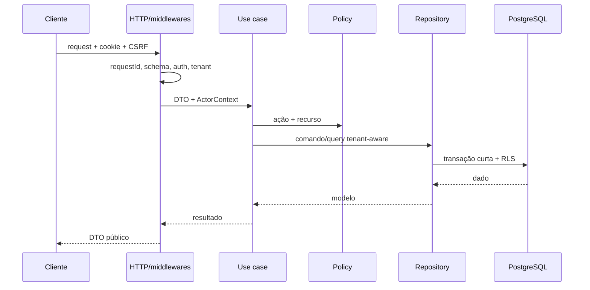

# Arquitetura de backend

Status: **parcial**, com monólito modular como alvo.

## Existente observado

Express/TypeScript, Prisma, controllers e services divididos por operação, contracts/validators, presenters, `CustomLogger`, rate limit, headers, CORS e upload. A autenticação produtiva ainda não está configurada; o middleware falha fechado fora do bypass de desenvolvimento.

## Estrutura alvo

```text
modules/<domain>/
├── http/             # routes/controllers/presenters
├── application/      # use cases e portas
├── domain/           # invariantes e eventos
├── contracts/        # schemas/DTOs
├── policies/         # autorização resource-aware
├── repositories/     # interfaces e implementação Prisma
├── integrations/     # adapters específicos
├── tests/
└── index.ts

platform/
├── auth, tenancy, audit, logger
├── database, outbox, jobs
├── files, notifications, integrations
└── config
```

Não é necessário mover tudo em uma única refatoração. Cada feature alterada adota a fronteira alvo de forma testada.

## Pipeline HTTP



## Regras de aplicação

- `ActorContext` imutável carrega request, usuário, membership, organização e permissões.
- Caso de uso não aceita valor calculado, permission list ou ownership do cliente como fato.
- Erro de domínio é convertido em código HTTP estável no boundary.
- Operação que persiste fato + evento grava ambos na mesma transação via outbox.
- Integração lenta/falhável ocorre depois do commit por worker, quando a experiência permitir.

## Evolução necessária

1. Extrair repositories de Prisma.
2. Implementar auth/sessão/TenantContext/RBAC antes de SaaS.
3. Migrar dinheiro/quantidade para Decimal e contratos string.
4. Introduzir outbox, worker e DLQ antes de integrações críticas.
5. Adicionar readiness, graceful shutdown, auditoria separada e telemetria estruturada.
