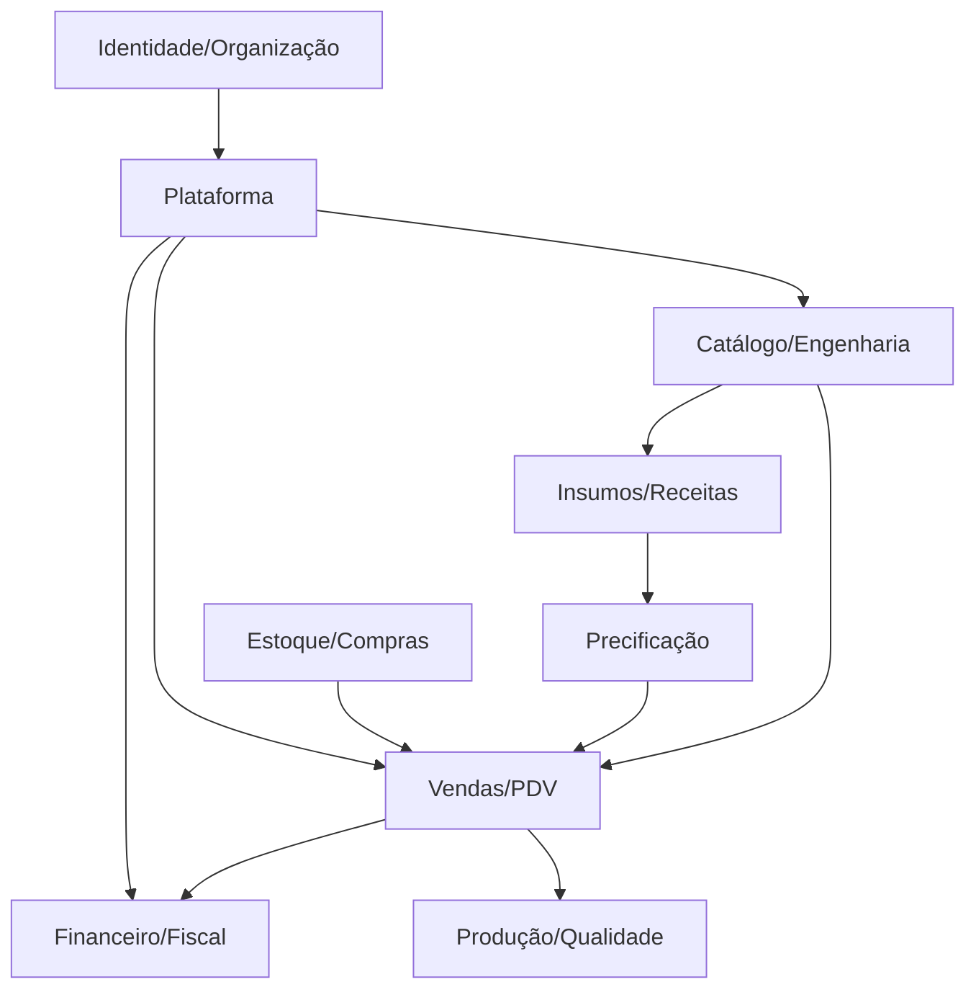

# Mapa de domínios

Status: **inventário parcial + alvo proposto**. “Existente” significa presença funcional observada, não prontidão produtiva.

| Bounded context | Estado | Owner e responsabilidades alvo |
| --- | --- | --- |
| Identidade e organizações | **Proposto** | usuário, membership, organização, sessão, RBAC e políticas |
| Catálogo e engenharia de produto | **Parcial** | produto, versão, SKU, mídia, composição e atributos |
| Insumos e receitas | **Parcial** | ingrediente, unidade, rendimento, ficha técnica e custo |
| Precificação | **Parcial** | parâmetros, fórmula versionada, custo, margem e preço |
| Agenda/serviços | **Parcial** | agendamento, status, fila, cliente e anexos |
| Despesas/financeiro | **Parcial** | despesas e histórico; contas, caixa, conciliação e DRE são alvo |
| Estoque e compras | **Proposto** | saldo, lote, movimentação, ruptura, requisição, pedido e recebimento |
| Vendas, pedidos e PDV | **Proposto** | carrinho, pedido, pagamento, produção e entrega |
| Fiscal/contábil | **Proposto/bloqueado** | documento fiscal, tributo e integração contábil dependem de especialista/provider |
| CRM e canais | **Proposto** | cliente, consentimento, atendimento, campanhas e portal |
| Produção/MES e qualidade | **Proposto** | ordem, apontamento, capacidade, rastreabilidade, qualidade e desperdício |
| Pessoas | **Proposto** | equipe, ponto, folha e talentos, sujeitos a LGPD trabalhista |
| Logística | **Proposto** | frete, expedição e rastreamento |
| Plataforma | **Proposto** | tenancy, auditoria, arquivos, notificação, outbox, jobs, integrações e billing SaaS |

## Dependências centrais

## Regras de evolução

- Cada contexto possui modelo, casos de uso, policies, repositories, contratos e eventos próprios.
- Contextos não importam detalhes internos entre si; usam API pública/eventos.
- Plataforma fornece concerns transversais sem absorver regra de negócio.
- Novo domínio só entra no roadmap com usuário, problema, owner, dados, integrações, aceite e risco definidos.
