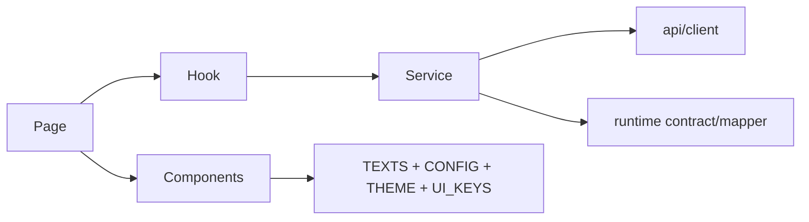

# Arquitetura de frontend

Status: **parcial**, com direção alvo proposta.

## Existente observado

- React 19 + TypeScript + Vite e React Router.
- Páginas lazy-loaded e error boundary.
- Features de agenda, produtos, insumos, receitas, despesas e precificação.
- `TEXTS`, `APP_CONFIG`, `ERP_THEME` e `UI_KEYS` como fontes centralizadas.
- Services por feature e componentes universais.
- Login não prova autenticação real; dashboard, DRE e estoque têm placeholder.

## Estrutura alvo por feature

```text
pages/<Domain>/
├── <Domain>Page.tsx           # composição
├── components/                # UI específica
├── hooks/                     # estado e orquestração
├── services/                  # fronteira HTTP
├── contracts/ ou utils/       # validação/mappers puros
├── types/
├── config/ e theme/           # somente quando específicos
├── tests/
└── index.ts                   # API pública
```



## Server state e mutações

- O service devolve DTO validado; hook expõe estado sem vazar Axios.
- Estado canônico retornado pela mutation atualiza o cache/local state; refetch só quando necessário.
- Busca usa debounce/abort; listagem usa paginação; páginas raras permanecem lazy.
- Permissões vindas da sessão controlam affordance, mas o endpoint revalida.

## Design system e editor visual

Tokens globais definem cor, tipografia, espaço, tamanho de toque, foco e breakpoints. Tema semântico define variantes por componente. `data-ui-key` mapeia elemento → chave → token/texto/configuração → override tenant-aware futuro. O [Estúdio Visual](./visual-editor.md) está **Parcial**: em DEV local já aplica propriedades allowlisted, mantém drafts locais versionados e oferece laboratório sandbox não publicável. Override SaaS ainda não existe e permanece **Bloqueado/Proposto** até schema, autenticação, TenantContext, RBAC, auditoria, CSP produtiva e rollback.

## Responsividade

- Mobile-first com navegação inferior/drawer conforme espaço; ação primária acessível ao polegar.
- Tabela complexa vira cards/detalhe expansível ou permite colunas prioritárias e scroll explícito.
- Modal mobile pode virar sheet/fullscreen; teclado virtual não oculta ações.
- Densidade pode variar, mas sequência, regra e resultado permanecem equivalentes.

## Débitos observados a tratar incrementalmente

- `frontend/README.md` ainda era template e foi substituído nesta entrega.
- Tema e dicionário pt-BR concentram muitos domínios; devem ser particionados sem quebrar a API pública.
- Há strings placeholder diretamente em `App.tsx` e autenticação visual sem proteção real.
- Auditoria automática de tamanho/import boundaries deve entrar no CI antes de expansão maciça.
