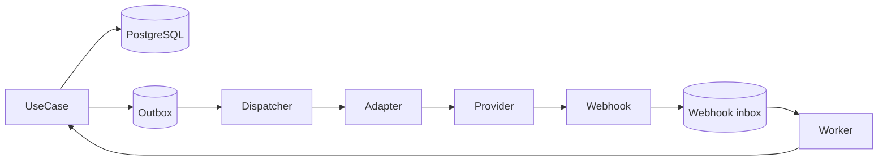

# Integrações, webhooks e outbox

Status: **arquitetura proposta**. Nenhum provider é aprovado por este documento.

## Padrão

## Outbox e workers

- Fato e outbox são gravados na mesma transação curta.
- Dispatcher busca em lotes, limita concorrência, marca tentativa e usa backoff/jitter.
- Evento possui idempotency/deduplication key. Após limite, vai para DLQ com reprocessamento auditado.
- Sucesso no transporte não equivale a conciliação de negócio; estados são separados.

## Webhook de entrada

1. Receber raw body sob limite.
2. Validar origem quando aplicável, assinatura em tempo constante, timestamp e janela de replay.
3. Persistir envelope mínimo/inbox com hash e ID do provider.
4. Responder rapidamente após aceite durável.
5. Processar assíncrono, validar schema/evento, deduplicar e aplicar caso de uso tenant-aware.
6. Registrar resultado sem payload sensível.

## Catálogo de adapters alvo

| Integração | Estado | Controles obrigatórios |
| --- | --- | --- |
| n8n/WhatsApp | **Proposto** | consentimento, templates, rate limit, assinatura e idempotência |
| pagamento/TEF/Pix | **Proposto/bloqueado** | provider, reconciliação, idempotência, assinatura e antifraude |
| fiscal | **Proposto/bloqueado** | jurisdição/especialista, certificado, numeração e contingência |
| e-commerce/portal | **Proposto** | contrato de catálogo/preço/estoque/pedido e reconciliação |
| object storage | **Proposto** | bucket privado, tenant prefix, checksum, scan e URL curta |
| e-mail | **Proposto** | provider, bounce, supressão, rate limit e sem enumeração |
| frete/rastreamento | **Proposto** | provider, eventos fora de ordem, retry e reconciliação |

## Contrato de integração

Toda integração registra owner, ambientes, direção, auth, schemas/versionamento, timeout, retry, idempotência, quotas, LGPD, observabilidade, reconciliação, fallback, custos e procedimento de desligamento.
