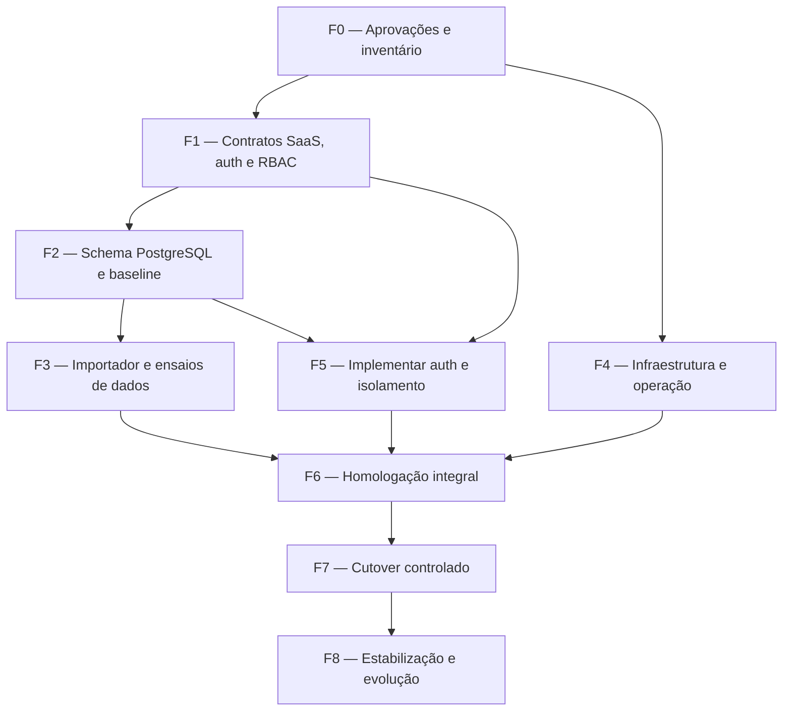

# Fases, decisões e riscos

Status: **proposta**. As fases abaixo são gates; aprovação documental não equivale a autorização para alterar código, schema ou infraestrutura.

## Dependências

| Fase | Entrega | Gate de saída |
| --- | --- | --- |
| F0 | decisões do proprietário, origem/owner/empresa bootstrap, inventário e SLOs | itens bloqueantes aprovados por escrito |
| F1 | contratos detalhados de tenancy, sessão, permission catalog, auditoria e API Decimal | threat model e matrizes revisados |
| F2 | schema PostgreSQL, RLS, nova baseline, cliente/contratos Decimal em task própria | banco nasce do zero no CI; isolamento estrutural testado |
| F3 | importador one-shot, relatório de reparos, manifestos e dois ensaios | reconciliação sem divergência não explicada e duração conhecida |
| F4 | VPS/staging, TLS, systemd, object storage, secrets, backup, métricas e runbooks | restore drill e rollback bem-sucedidos |
| F5 | login, cookies/CSRF/reset/sessões, RBAC e tenant context em todos os módulos | testes cross-tenant e de segurança verdes; bypass desativado |
| F6 | staging equivalente, carga, segurança, restore/cutover game day | checklist de lançamento assinado |
| F7 | freeze, backup final, import, validação, troca e observação | aceite de dados e operação; decisão explícita do gate de não retorno |
| F8 | monitoramento reforçado, correções, revisão de capacidade e SLOs | período de estabilização encerrado pelo proprietário |

F1–F3 e F5 devem ser executadas em mudanças pequenas e revisáveis; não concentrar tenancy, auth, Decimal e migração de todos os módulos em um único commit.

## Decisões propostas

1. `Organization` é o tenant; banco/schema compartilhado com `organizationId`, constraints compostas e RLS obrigatório.
2. `User` é identidade global por e-mail normalizado; acesso ocorre por `Membership` e roles pertencem à organização.
3. Sessões são opacas, server-side e revogáveis, com uma membership ativa por sessão.
4. RBAC é default-deny, permissões aditivas e estáveis; roles de sistema iniciais são Owner, Admin, Manager, Operator e Viewer.
5. A transição cria PostgreSQL vazio pela nova baseline e importa dados com ferramenta one-shot; a cadeia SQLite fica apenas no histórico de custódia.
6. Decimais usam tipos nativos, strings HTTP e arredondamento explícito; moeda base inicial é BRL, sem conversão implícita.
7. Caddy + systemd é a operação inicial recomendada; frontend e API permanecem same-origin.
8. PostgreSQL não é público; backups, WAL, object storage e observabilidade têm cópia fora da VPS.
9. Uploads de produção são privados, tenant-prefixed, registrados no banco, verificados e servidos após autorização.
10. Migrations são etapa única de deploy e seguem expand/contract; readiness verifica banco e versão esperada.

## Aprovações necessárias do proprietário

| ID | Confirmar | Recomendação atual | O que fica bloqueado |
| --- | --- | --- | --- |
| A1 | shared schema + RLS, schema por tenant ou banco por tenant | shared schema + RLS, com caminho híbrido futuro | modelo de dados e operação |
| A2 | nome, slug, moeda e status da empresa legada; e-mail do primeiro owner | uma organização bootstrap ativa em BRL | importação e primeiro acesso |
| A3 | e-mail global e uma empresa ativa por sessão; necessidade de abas multiempresa | identidade global e uma membership ativa | modelo de sessão |
| A4 | matriz Owner/Admin/Manager/Operator/Viewer e custom roles | matriz deste documento; custom roles sem UI inicial | catálogo RBAC e testes |
| A5 | provedor de e-mail, política de senha, MFA e tempos de sessão/reset | e-mail transacional; MFA obrigatório para owner/admin antes de produção financeira | autenticação externa |
| A6 | escalas Decimal, `HALF_UP`, tolerâncias e regra para snapshots | escalas propostas; converter snapshot para strings versionadas | schema, fórmulas e ETL |
| A7 | arquivo SQLite oficial e regra para as 58 FKs órfãs observadas | reparar por regra auditável, nunca descartar silenciosamente | ensaio de migração |
| A8 | janela de freeze/downtime e momento do gate de não retorno | janela medida por dois ensaios completos | cutover |
| A9 | provedor/região da VPS, PostgreSQL local ou gerenciado e versão major | VPS Linux LTS; avaliar gerenciado por custo/risco | runbooks e orçamento |
| A10 | domínio/DNS e Caddy ou Nginx | Caddy e mesma origem para frontend/API | TLS, cookies e proxy |
| A11 | provedor/região/retention do object storage e residência dos dados | S3-compatible privado fora da VPS | uploads e restore |
| A12 | RPO, RTO, retenção e orçamento de backup | RPO 15 min, RTO 4 h; 7 diários/4 semanais/12 mensais | desenho de recuperação |
| A13 | destino/retenção de logs, métricas, auditoria e requisitos LGPD | telemetria fora da VPS, minimização de PII | observabilidade e compliance |
| A14 | política de suspensão/exclusão/exportação de organização | soft-delete inicial, export e retenção antes de purge | offboarding SaaS |

## Riscos e mitigação

| Risco | Mitigação/gate |
| --- | --- |
| vazamento entre empresas por query, cache, job ou arquivo | contexto central, filtros compostos, RLS `FORCE`, allowlist global e testes com duas organizações antes do segundo tenant |
| dados legados órfãos ou fonte incorreta | escolha formal da origem, freeze/checksum, relatório de reparo e zero FKs inválidas antes do import |
| ruído de `Float` virar valor financeiro definitivo | transformação por escala aprovada, relatório de delta, recálculo independente e aceite do proprietário |
| snapshots históricos mudarem de significado | formato versionado, conversor por paths conhecidos e export bruto imutável |
| baseline não representar o schema real | gerar do schema aprovado, revisão SQL, deploy em banco vazio e schema diff no CI |
| credencial/sessão comprometida | Argon2id, cookie `__Host-`, CSRF/origin, TLS, rotação, revogação e MFA aprovado |
| reset de senha usado para enumeração ou takeover | respostas uniformes, token hash single-use/curto, rate limit e origem fixa |
| VPS única indisponível ou destruída | dados/objetos/backups externos, PITR, releases reproduzíveis e restore drill; alta disponibilidade fica para fase posterior |
| backup existe, mas não restaura | restauração mensal automatizada com smoke e evidência; alertas de idade/WAL |
| rollback após novas escritas no PostgreSQL causa perda | gate de não retorno, freeze, expand/contract, PITR e preferência por correção forward |
| upload malicioso ou exposição pública | bucket privado, quarentena, verificação de assinatura/antimalware, ownership e URL curta |
| e-mail ou object storage indisponível | métricas, retry idempotente, UX de degradação e classificação explícita de dependência crítica |
| noisy neighbor/custo imprevisível | quotas por organização, rate limit tenant-aware, métricas sem labels de alta cardinalidade e revisão de capacidade |
| logs/auditoria exporem PII ou não atenderem LGPD | minimização, separação técnico/auditoria, controle de acesso e retenção aprovada |
| complexidade exceder capacidade operacional | fases com gates, staging equivalente, runbooks, automação de restore e possibilidade de PostgreSQL gerenciado |

## Registro de aceite

Antes de abrir tasks de implementação, as decisões A1–A14 devem ter responsável, data e resposta registrada. Qualquer desvio das recomendações atualiza primeiro estes documentos e explicita impacto em segurança, dados, custo e cronograma.
