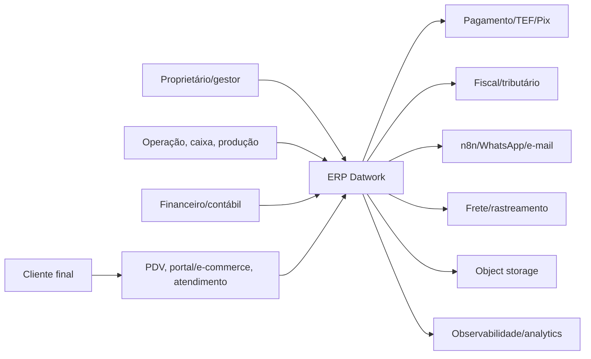

# Contexto do sistema

Status: **proposto**, com atores e integrações ainda sujeitos a validação de produto/contrato.

## Fronteiras

- ERP Datwork é owner apenas dos domínios implantados e aprovados. Provider externo continua owner de liquidação, documento fiscal ou mensagem entregue conforme contrato.
- Canal de venda envia intenção/pedido; backend valida preço, estoque, permissão e idempotência.
- Carro Chefe é cliente de referência, não hardcode de domínio. Personalização usa organização, catálogo, configuração, feature flag e tema.
- Dados pessoais entram somente com finalidade, minimização, retenção e permissão aprovadas.

## Qualidades prioritárias

Segurança multiempresa, precisão financeira, rastreabilidade, disponibilidade operacional, performance previsível, acessibilidade, experiência móvel e recuperação verificável.
