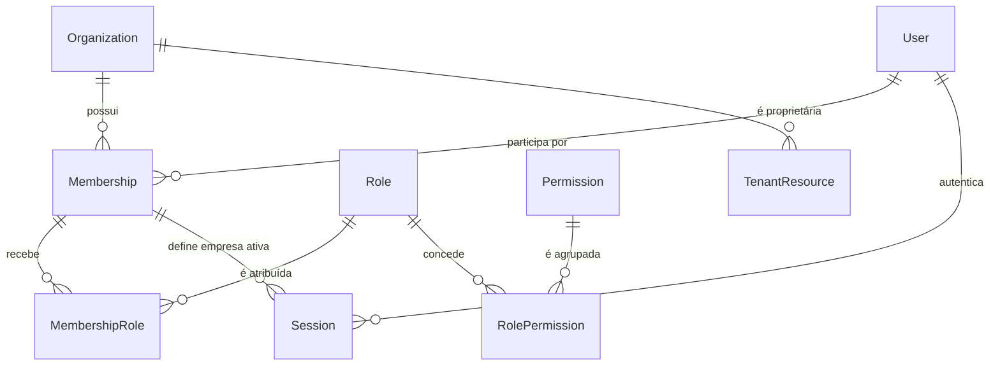

# Tenancy e RBAC

Status: **proposta**. `Tenant` e `Organization` representam o mesmo limite de propriedade de dados; o nome adotado no domínio será `Organization`.

## Modelo proposto

| Entidade | Campos essenciais futuros | Invariantes |
| --- | --- | --- |
| `Organization` | `id`, `name`, `slug`, `status`, `baseCurrency`, timestamps | `slug` globalmente único; status inativo bloqueia acesso; ao menos um owner ativo |
| `User` | `id`, `email`, `normalizedEmail`, `passwordHash`, `status`, `emailVerifiedAt`, timestamps | identidade global; e-mail normalizado globalmente único; não contém autorização de empresa |
| `Membership` | `id`, `organizationId`, `userId`, `status`, timestamps | única por organização e usuário; suspensão encerra as sessões daquela membership |
| `Role` | `id`, `organizationId`, `code`, `name`, `isSystem`, timestamps | pertence a uma organização; `code` único dentro dela; roles de sistema têm invariantes protegidos |
| `Permission` | `code`, `module`, `action`, `description` | catálogo global, versionado no código, sem dados do tenant |
| `MembershipRole` | `membershipId`, `roleId`, timestamps | par único e organização idêntica nos dois lados |
| `RolePermission` | `roleId`, `permissionCode` | par único; concessões são aditivas, sem regras de negação na primeira versão |

Uma pessoa pode participar de várias empresas. A sessão aponta para uma `Membership` ativa, não apenas para um `organizationId`; a troca de empresa valida a membership e rotaciona o identificador da sessão. Esta primeira versão assume uma empresa ativa por sessão. Uso simultâneo de empresas em abas diferentes exige decisão específica.

Não haverá flag global `isAdmin` no usuário. Administração de plataforma, se criada, será um domínio separado e não poderá reutilizar silenciosamente permissões de uma empresa.

## Dados pertencentes à organização

Todos os modelos de negócio atuais são tenant-owned: `Appointment`, `Product`, `ProductVersion`, `CustomOrderProfile`, `Ingredient`, `IngredientVersion`, `Recipe`, `RecipeItem`, `Expense`, `ExpenseVersion` e `PricingSetting`. Metadados de uploads, auditoria, filas, caches e futuras entidades de negócio também serão tenant-owned.

As únicas tabelas globais iniciais serão a allowlist explícita de identidade e catálogo: `User`, `Permission`, tokens de autenticação/recuperação e metadados estritamente operacionais. `Membership`, `Role` e seus vínculos não são globais mesmo quando consultados por um fluxo de identidade.

Regras de modelagem futuras:

- `organizationId` será obrigatório em cada linha tenant-owned, inclusive filhos cujo tenant poderia ser inferido do pai.
- Chaves naturais deixam de ser globais. Exemplo: SKU único por `organizationId`, não em toda a plataforma.
- FKs tenant-owned serão compostas por `organizationId` e ID do recurso sempre que o banco suportar a relação, impedindo vínculos cruzados.
- `PricingSetting` será uma configuração única por organização; o ID fixo global atual não continuará como fronteira de unicidade.
- Snapshots e objetos JSON terão `organizationId` na linha proprietária e versão explícita de formato.
- IDs opacos reduzem enumeração, mas nunca substituem autorização.

## Isolamento obrigatório

O isolamento terá camadas independentes e falhará fechado:

1. A autenticação resolve `User`, `Session` e `Membership` ativa.
2. Um middleware cria um `TenantContext` imutável com `organizationId`, `userId`, `membershipId`, permissões e `requestId`.
3. Controllers apenas encaminham o contexto; services e repositórios exigem `TenantContext` em sua assinatura.
4. Toda leitura, escrita, agregação, reorder, histórico e recálculo filtra por `organizationId`. Operações por ID usam chave composta.
5. O banco aplica RLS em todas as tabelas tenant-owned, com `USING` e `WITH CHECK` baseados em `organization_id = current_setting('app.organization_id', true)`.
6. A role PostgreSQL da aplicação não é owner, superuser nem `BYPASSRLS`; as tabelas usam `ENABLE ROW LEVEL SECURITY` e `FORCE ROW LEVEL SECURITY`.
7. O contexto de RLS é definido com parâmetro dentro da transação e escopo local. Ausência, valor inválido ou tabela sem política resulta em acesso negado.
8. Uploads, cache, jobs, exportações e logs recebem o mesmo contexto. Jobs sem organização explícita são rejeitados.

RLS não elimina o filtro da aplicação; é a barreira de contenção caso um filtro seja esquecido. Como o contexto PostgreSQL depende da conexão, a implementação com Prisma deve encapsular a operação tenant-aware em transação curta e usar apenas SQL parametrizado para `set_config`. O papel de migration é separado do papel de runtime.

`Session`, `User` e tokens formam o control plane mínimo necessário para descobrir a identidade antes do tenant. A primeira leitura busca a sessão somente por `tokenHash`; em seguida, o servidor define `app.user_id` e valida a `Membership` ativa antes de definir `app.organization_id`. `Membership` e `Organization` terão políticas RLS específicas de bootstrap que permitem ao usuário autenticado listar apenas suas próprias memberships/organizações; escrita continua restrita ao tenant ativo e ao RBAC. Não haverá conexão genérica com bypass para consultar dados de negócio.

Uma allowlist central identifica tabelas globais. Criar nova tabela tenant-owned sem `organizationId`, RLS, índice e teste de isolamento deve falhar no CI. Nenhum endpoint de “admin” pode contornar essa regra.

## RBAC inicial

Permissões usam códigos estáveis no formato `recurso.ação`, verificadas no backend. Rotas fazem uma verificação grosseira; services repetem a autorização quando a ação ou o estado do recurso exigir granularidade adicional. O padrão é negar.

| Família de permissão | Owner | Admin | Manager | Operator | Viewer |
| --- | --- | --- | --- | --- | --- |
| `organization.read` | sim | sim | sim | sim | sim |
| `organization.update` | sim | sim | não | não | não |
| `organization.transfer` | sim | não | não | não | não |
| `members.read` | sim | sim | sim | não | não |
| `members.manage`, `roles.manage` | sim | sim, exceto owner | não | não | não |
| `audit.read` | sim | sim | sim | não | não |
| `agenda.read/write` | sim | sim | sim | sim | somente leitura |
| `products.read/write`, `ingredients.read/write`, `recipes.read/write` | sim | sim | sim | sim | somente leitura |
| `pricing.read/write`, `expenses.read/write` | sim | sim | sim | somente leitura | somente leitura |
| `uploads.read/write` | sim | sim | sim | sim | somente leitura |

Esta matriz é um ponto inicial, não uma regra de negócio aprovada. `Owner`, `Admin`, `Manager`, `Operator` e `Viewer` serão roles de sistema criadas por organização. O modelo já aceita roles personalizadas, mas a primeira interface pode expor apenas as roles de sistema até haver auditoria e testes suficientes.

Invariantes de autorização:

- nunca remover, suspender ou rebaixar o último owner ativo;
- apenas owner transfere ownership ou altera outro owner;
- mudanças de membership/role revogam as sessões afetadas e geram evento de auditoria;
- permissões são recalculadas no servidor, não aceitas de cookies ou payloads;
- recursos de outra organização respondem como inexistentes, sem confirmar sua existência;
- ações sensíveis exigem autenticação recente, além da permissão.

## Testes que bloqueiam o lançamento

- Duas organizações com dados semelhantes exercitam CRUD, busca, agregação, reorder, histórico, recálculo e cascatas sem vazamento.
- IDs de uma organização são enviados em todas as rotas da outra e nunca produzem leitura ou mutação.
- Acesso Prisma e SQL direto sem contexto de RLS retorna zero linhas ou erro, conforme o tipo de operação.
- Uma role de runtime tenta `BYPASSRLS`, trocar o contexto e acessar tabela sem política; todos os casos falham.
- Upload, cache e job validam ownership da organização.
- Matriz de permissão cobre cada endpoint e cada operação sensível; ausência de permissão retorna `403`, ausência de recurso no tenant retorna `404`.

Referências: [OWASP Multi-Tenant Security](https://cheatsheetseries.owasp.org/cheatsheets/Multi_Tenant_Security_Cheat_Sheet.html), [OWASP Authorization](https://cheatsheetseries.owasp.org/cheatsheets/Authorization_Cheat_Sheet.html) e [PostgreSQL Row Security](https://www.postgresql.org/docs/current/ddl-rowsecurity.html).
