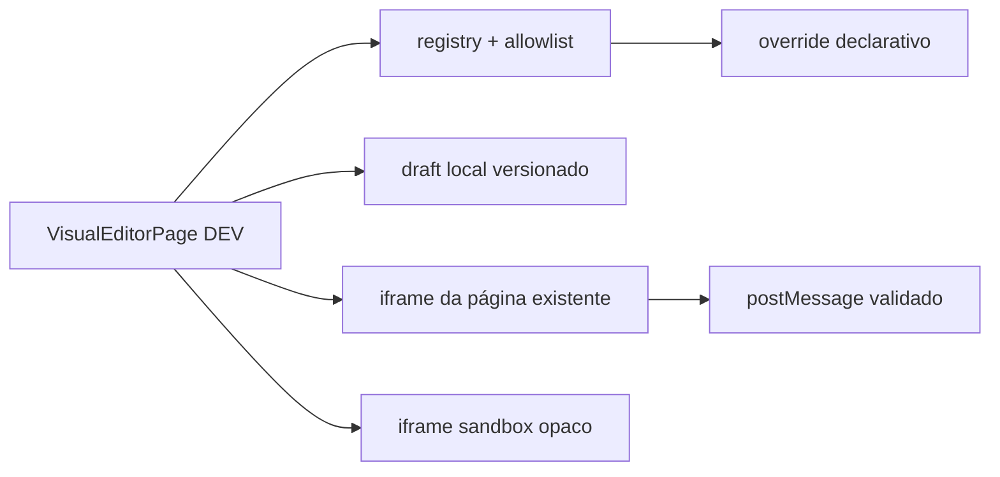

# Estúdio Visual

Status: **Parcial — implementado somente para desenvolvimento local**.

## Escopo e owner

O Estúdio Visual permite experimentar a aparência de páginas existentes em um checkout local. O owner técnico é **AG-Development**, com revisão de **AG-Security**, **AG-UI/UX** e **AG-Documentation**. A capacidade não é uma publicação SaaS nem uma configuração tenant-aware.

## Evidência implementada

- Rota DEV lazy e redirecionamento fora de DEV: [`frontend/src/App.tsx`](../../frontend/src/App.tsx), [`frontend/src/config/routes.config.ts`](../../frontend/src/config/routes.config.ts).
- Registro de páginas e superfícies `data-ui-key`: [`frontend/src/pages/VisualEditor/registry/visualEditor.registry.ts`](../../frontend/src/pages/VisualEditor/registry/visualEditor.registry.ts), [`frontend/src/ui/keys.ts`](../../frontend/src/ui/keys.ts).
- Propriedades e valores CSS tipados por allowlist, validação de draft/importação e limite de overrides: [`frontend/src/pages/VisualEditor/contracts/propertyPolicy.ts`](../../frontend/src/pages/VisualEditor/contracts/propertyPolicy.ts), [`frontend/src/pages/VisualEditor/contracts/visualEditor.validation.ts`](../../frontend/src/pages/VisualEditor/contracts/visualEditor.validation.ts).
- Preview desktop/tablet/mobile e bridge com validação de `source`, `origin`, canal, versão e payload: [`frontend/src/pages/VisualEditor/preview/PreviewPane.tsx`](../../frontend/src/pages/VisualEditor/preview/PreviewPane.tsx), [`frontend/src/pages/VisualEditor/preview/VisualEditorBridge.tsx`](../../frontend/src/pages/VisualEditor/preview/VisualEditorBridge.tsx).
- Draft local versionado, import/export, histórico limitado, undo/redo e reset: [`frontend/src/pages/VisualEditor/hooks/useVisualEditorDraft.ts`](../../frontend/src/pages/VisualEditor/hooks/useVisualEditorDraft.ts), [`frontend/src/pages/VisualEditor/storage/visualEditor.storage.ts`](../../frontend/src/pages/VisualEditor/storage/visualEditor.storage.ts).
- Laboratório de HTML/CSS/JavaScript em `iframe` opaco com `sandbox="allow-scripts"` e CSP restritiva: [`frontend/src/pages/VisualEditor/lab/isolatedLabDocument.ts`](../../frontend/src/pages/VisualEditor/lab/isolatedLabDocument.ts), [`frontend/src/pages/VisualEditor/components/IsolatedCodeLab.tsx`](../../frontend/src/pages/VisualEditor/components/IsolatedCodeLab.tsx).

## Fluxo

Overrides aplicados a páginas do ERP permanecem declarativos: chave conhecida, propriedade permitida e valor validado. CSS livre, seletor livre e HTML/JavaScript não entram no shell do ERP. O laboratório aceita código para experimentação isolada e é explicitamente **não publicável**.

## Segurança, limites e riscos

- **Implementado:** a rota é DEV-only; drafts não saem do navegador e não carregam tenant, credencial ou PII; o preview rejeita mensagens fora da ponte esperada; o laboratório não recebe acesso same-origin, rede, formulário, popup, storage ou frames.
- **Parcial:** CSP impede capacidades comuns no laboratório, mas contenção de CPU/memória não é garantida pelo navegador; `navigate-to` pode não ser aplicado de forma uniforme entre engines. O laboratório deve ser tratado como código arbitrário local e nunca como isolamento de segurança forte.
- **Bloqueado:** publicar override, HTML, CSS ou JavaScript para usuários, tenants ou backend sem autenticação real, RBAC, escopo tenant, auditoria, CSP produtiva, revisão de conteúdo, versionamento e rollback.
- **Proposto:** contrato futuro de publicação tenant-aware via API versionada, com auditoria, aprovação, preview reproduzível, rollback e limites de conteúdo. Não há endpoint ou persistência desse contrato nesta entrega.

## Aceite e validação

Aceite local: abrir a rota em DEV, selecionar página/superfície, aplicar override permitido, alternar viewport, desfazer/refazer, exportar/importar draft válido e executar o laboratório sem acesso à origem da aplicação. Evidência automatizada em [`frontend/tests/visual-editor.test.mjs`](../../frontend/tests/visual-editor.test.mjs); gates do frontend são os definidos em [`AGENTS.md`](../../AGENTS.md).

Dependências: React/Vite, `UI_KEYS`, tema/configuração existentes e o checkout confiável. A ferramenta não altera a autoridade do backend nem os contratos financeiros.
