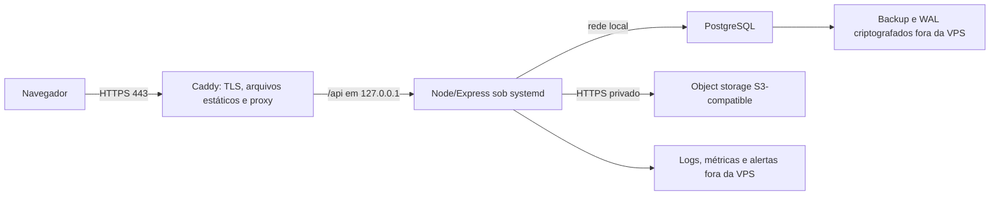

# Operação inicial na VPS

Status: **proposta**. A topologia prioriza simplicidade operacional sem tornar o banco ou os uploads públicos.

## Topologia recomendada

Fase inicial recomendada: uma VPS Linux LTS, Caddy, backend Node gerenciado por systemd e PostgreSQL local ouvindo apenas em loopback/socket. Frontend é build estático. Object storage, backups e destino de observabilidade ficam fora da VPS para não compartilhar o mesmo ponto de falha.

PostgreSQL gerenciado reduz risco operacional, mas aumenta custo; essa escolha permanece para aprovação. O banco nunca expõe a porta à internet.

## Host e rede

- Usuários separados para deploy e runtime; aplicação não roda como root.
- SSH somente por chave, acesso administrativo restrito, firewall permitindo apenas SSH controlado e portas 80/443.
- Atualizações de segurança, relógio sincronizado, espaço/inodes monitorados e reinicializações planejadas.
- Segredos em arquivo de ambiente fora do repositório, legível apenas pelo serviço; credenciais distintas para runtime, migration, backup e object storage.
- Ambientes de staging e produção não compartilham banco, bucket, chaves, cookies ou origem.

## TLS e proxy reverso

Caddy é a recomendação inicial por automatizar emissão/renovação TLS e redirect HTTP→HTTPS. Nginx + ACME é alternativa válida se houver preferência operacional.

- DNS deve apontar para a VPS antes da emissão; 80 e 443 chegam somente ao proxy.
- Frontend e API usam a mesma origem; `/api/*` é encaminhado a `127.0.0.1`, e o restante serve o frontend com fallback controlado da SPA.
- Proxy define limites de corpo, timeouts e access log; upload não herda limites ilimitados.
- Backend confia em exatamente um proxy conhecido. Headers encaminhados pelo cliente não são confiados diretamente.
- HSTS entra após domínio, subdomínios e renovação estarem validados; não habilitar `preload` na estreia.
- Cookies só são emitidos após HTTPS. Páginas autenticadas não recebem cache público.

Referência: [Caddy Automatic HTTPS](https://caddyserver.com/docs/automatic-https) e [Caddy reverse_proxy](https://caddyserver.com/docs/caddyfile/directives/reverse_proxy).

## Processo e release

O backend roda como unidade systemd com usuário próprio, diretório de trabalho versionado, `NODE_ENV=production`, restart em falha e limites explícitos. `SIGTERM` inicia graceful shutdown: deixa de aceitar conexões, aguarda requests até o timeout, fecha o pool e termina. Loops de restart disparam alerta.

Releases ficam em diretórios imutáveis como `/opt/datwork/releases/<release-id>`, com symlink `current`. Artefatos são produzidos pelo CI, têm checksum e não são compilados como root na VPS.

Ordem do deploy:

1. CI verde, artefatos e checksum; confirmar compatibilidade de migration/rollback.
2. Backup pré-deploy e verificação de espaço/saúde.
3. Colocar novo release sem alterar `current`.
4. Rodar `prisma migrate deploy` uma única vez, com role de migration e como etapa separada.
5. Trocar symlink, reiniciar backend, aguardar readiness e executar smoke autenticado.
6. Publicar frontend compatível e observar métricas/logs.

Migration nunca roda no `ExecStart`. Em múltiplos processos futuros, o deploy continua com um único executor de migration.

Rollback de binário troca para o release anterior somente quando as migrations forem retrocompatíveis. Alterações de banco usam expand/contract: adicionar primeiro, migrar dados, trocar leitores/escritores e remover apenas em release posterior. Migration destrutiva exige backup restaurado em ensaio e plano específico; em caso incompatível, preferir correção forward ou PITR.

## Liveness, readiness e startup

- `GET /health`: processo vivo; não consulta dependências e retorna somente status/release sem segredos.
- `GET /ready`: timeout curto, confirma conexão PostgreSQL, versão de migration esperada e configurações obrigatórias. É read-only, não cria tabelas nem arquivos.
- Falha de object storage aparece em métrica/health interno e bloqueia endpoints de upload; só derruba readiness se uploads forem classificados como críticos para toda a aplicação.
- O proxy envia tráfego somente após readiness. Durante shutdown, readiness falha antes do encerramento das conexões.
- Um check interno detalhado pode existir para operadores; o endpoint público não expõe versão de banco, hostname ou erro bruto.

O `/health` atual permanece conceitualmente liveness; readiness precisa ser implementado e testado antes do lançamento.

## Backups, restauração e rollback de dados

Proposta inicial sujeita a RPO/RTO:

- backup físico/base e arquivamento contínuo de WAL em destino criptografado fora da VPS, permitindo PITR com RPO alvo de até 15 minutos;
- `pg_dump` custom-format noturno como cópia lógica portátil e antes de migrations relevantes;
- retenção proposta: 7 diários, 4 semanais e 12 mensais; WAL conforme a janela de PITR aprovada;
- bucket de backup com versionamento/imutabilidade, credencial write-only quando possível e chave de criptografia guardada separadamente;
- alertas para atraso de WAL, falha, backup antigo, crescimento anormal e destino sem espaço.

Todo mês, uma restauração automatizada ocorre em ambiente isolado: restaurar base + WAL para ponto escolhido, executar integridade, migrations esperadas, contagens e smoke. Resultado, duração e evidências são registrados. Ao menos uma vez por trimestre, o procedimento é acompanhado do início ao fim por uma pessoa.

Backup de banco não contém objetos. Metadados e objetos precisam de manifestos/checksums coordenados. Credenciais, configuração do proxy e runbooks têm cópia segura própria.

RPO proposto: 15 minutos. RTO proposto: 4 horas. O proprietário deve aprovar metas, retenção, custo e região antes de contratar a infraestrutura.

## Logs, métricas e alertas

`CustomLogger` continua como fronteira da aplicação, mas a implementação operacional futura deve emitir JSON estruturado para stdout/journald e permitir envio externo. Campos mínimos: timestamp UTC, severity, service, environment, release, event, requestId, duração e status. `organizationId`/`userId` só entram quando necessários e conforme política LGPD.

Nunca registrar senha, cookies, CSRF, reset token, authorization header, payload financeiro completo, conteúdo de upload ou PII desnecessária. URLs são higienizadas. Eventos de auditoria de negócio ficam separados de logs técnicos e têm retenção própria.

Métricas mínimas:

- requests, latência e erros por rota normalizada; conexões e queries lentas do banco;
- CPU, memória, event loop, restarts, disco e inodes;
- login/recuperação falhos, revogações, CSRF e negações de tenant/RBAC;
- idade/sucesso do backup, atraso de WAL e resultado/duração de restore drill;
- uploads aceitos/rejeitados, bytes e falhas de storage/scan;
- validade TLS e resultado de liveness/readiness externos.

IDs de empresa/usuário não viram labels de métricas de alta cardinalidade. Alertas iniciais: indisponibilidade/readiness, aumento sustentado de 5xx/latência, banco sem conexão, disco crítico, backup/WAL atrasado, certificado próximo do vencimento e repetidas violações de isolamento.

## Armazenamento de uploads

Produção usará bucket S3-compatible privado; disco local continua apenas para desenvolvimento ou staging descartável.

- Chave opaca `organizations/<organizationId>/<uuid>`, sem nome original nem caminho fornecido pelo cliente.
- Tabela de metadados tenant-owned com object key, nome higienizado, MIME declarado/detectado, tamanho, SHA-256, status, criador e timestamps.
- Upload entra em quarentena, aplica limite, allowlist, assinatura de conteúdo e varredura antimalware antes de ficar disponível.
- Download valida sessão, membership, permissão e ownership; URL assinada tem prazo curto proposto de 5 minutos e bucket nunca é público.
- Criptografia em trânsito/repouso, versionamento, lifecycle, quotas por organização e política de exclusão/retention.
- Migração dos quatro arquivos locais observados deve comparar tamanho e SHA-256 antes de atualizar referências; a contagem será repetida sobre a origem oficial.

Arquivos do tenant não devem compartilhar cookies com host de conteúdo público não confiável. Se downloads passarem a usar domínio separado, `Content-Disposition`, MIME e políticas de conteúdo serão definidos para evitar execução ativa.
