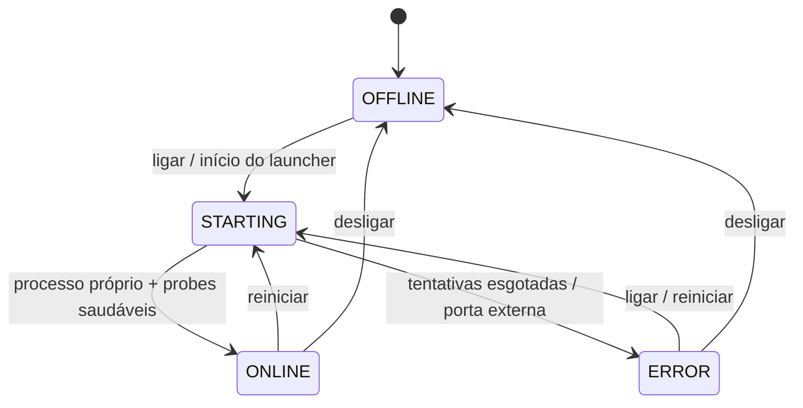

# Inicializador Windows

Status: **Parcial — implementado para checkout de desenvolvimento local**.

## Escopo e owner

O inicializador é uma conveniência operacional para Windows: inicia e supervisiona o stack local do checkout, mostra estado na área de notificação e oferece ações de ciclo de vida. Owner técnico: **AG-Development**; revisão proporcional por **AG-Security**, **AG-Testing** e **AG-Documentation**.

## Evidência implementada

- Domínio, supervisor, processo próprio, probes e logger limitado: [`tools/windows-launcher/Domain`](../../tools/windows-launcher/Domain), [`tools/windows-launcher/Application`](../../tools/windows-launcher/Application), [`tools/windows-launcher/Infrastructure`](../../tools/windows-launcher/Infrastructure).
- Bandeja, estados com cor e texto, menus de ligar/desligar/reiniciar/abrir: [`tools/windows-launcher/Presentation/TrayApplicationContext.cs`](../../tools/windows-launcher/Presentation/TrayApplicationContext.cs), [`tools/windows-launcher/Presentation/StatusIconFactory.cs`](../../tools/windows-launcher/Presentation/StatusIconFactory.cs).
- Build e instalação reversível para o usuário atual: [`tools/windows-launcher/build.ps1`](../../tools/windows-launcher/build.ps1), [`tools/windows-launcher/install.ps1`](../../tools/windows-launcher/install.ps1), [`tools/windows-launcher/uninstall.ps1`](../../tools/windows-launcher/uninstall.ps1).
- Stack fixo em loopback e encerramento cooperativo: [`tools/dev-stack.mjs`](../../tools/dev-stack.mjs).

## Estados e fluxo

| Estado | Indicador | Critério |
| --- | --- | --- |
| `OFFLINE` | cinza + texto | stack local desligado |
| `STARTING` | laranja + texto | inicialização ou espera por probes |
| `ONLINE` | verde + texto | processo filho próprio vivo, backend `/health` e frontend respondendo |
| `ERROR` | vermelho + texto | falha, tentativas limitadas ou ocupação externa detectada |

`ONLINE` é saúde do ambiente local, não readiness produtivo. O `GET /ready` continua **Proposto** e o launcher não o implementa.

## Instalação, operação e desinstalação

1. `npm run launcher:build` gera executável/ícone ignorados.
2. `npm run launcher:install` grava configuração local e cria atalhos no Startup e Desktop do usuário atual; `-StartNow` pode iniciar imediatamente.
3. O launcher inicia `node.exe tools/dev-stack.mjs` sem shell, sempre a partir da raiz validada, e publica somente em `127.0.0.1`.
4. `Abrir ERP no navegador` abre a URL local; a bandeja mantém ações de ciclo de vida.
5. `npm run launcher:uninstall` pede encerramento cooperativo e remove atalhos/configuração do launcher. O checkout, dependências e banco local não são removidos.

Instalação automática no login e criação dos atalhos somente existem após a ação explícita de instalação; build/teste não criam efeitos externos.

## Segurança, limites e riscos

- **Implementado:** configuração valida raiz, `node.exe`, script, portas e URLs; não há comando, shell ou URL livre; somente a árvore de processo criada pela instância é controlada; mutex evita duas instâncias; logs são limitados e não registram ambiente/segredos.
- **Implementado:** parada cooperativa usa named pipe efêmero, comando versionado e nonce aleatório; fallback forçado restringe-se ao PID próprio após timeout.
- **Limitação explícita:** não há ACL por SID portátil no servidor de pipe usado pelo stack; o nonce mitiga conexões indevidas no mesmo host, mas não equivale a controle administrativo de produção.
- **Parcial:** o laboratório visual e o launcher são ferramentas locais; nenhum deles fornece atualização, assinatura, distribuição, serviço Windows, hardening de host ou observabilidade SaaS.
- **Proposto/Bloqueado:** deploy em VPS, systemd/Caddy/TLS, PostgreSQL, readiness, backup/restore, autenticação real e operação multiempresa seguem [`vps-operations.md`](../architecture/vps-operations.md) e exigem gates próprios. Este launcher não deve ser instalado em VPS nem tratado como binário distribuível/assinado.

## Aceite e validação

Aceite local: build sem criar atalhos, teste do supervisor, instalação por usuário atual, presença dos atalhos, startup do stack, transição cinza→laranja→verde, ações de abrir/desligar/reiniciar e desinstalação sem resíduos do launcher. Evidências automatizadas em [`tests/windows-launcher.test.mjs`](../../tests/windows-launcher.test.mjs) e gates regionais descritos em [`tools/windows-launcher/AGENTS.md`](../../tools/windows-launcher/AGENTS.md).

Riscos residuais: falha de processo externo na porta pode produzir erro após tentativas limitadas; o host Windows pode encerrar o processo; named pipes e ícones dependem do ambiente local; não há contenção de recursos para código arbitrário do laboratório visual.
