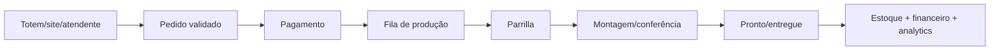

# Fit-gap — Carro Chefe

Status: **requisitos de referência; implementação majoritariamente proposta**. O Carro Chefe escolheu o ERP Datwork, ainda em desenvolvimento. Este documento não afirma que os fluxos já funcionam.

## Necessidades prioritárias

| Capacidade | Necessidade Carro Chefe | Estado ERP observado | Gap/aceite alvo |
| --- | --- | --- | --- |
| catálogo/cardápio | produtos, variações, adicionais, combos e IDs estáveis | **Parcial**: produtos/receitas | modelar modificadores/combos/alérgenos; API pública estável |
| ficha técnica | gramatura, rendimento, insumo, custo e versão | **Parcial**: receitas/insumos | Decimal/unidades, rendimento/perda e histórico auditável |
| precificação | CMV, margem, adicionais e preço por canal | **Parcial** | Decimal/fórmula versionada e aprovação de preço |
| estoque/compras | entrada, consumo por receita, ruptura, perda, inventário e fornecedor | **Proposto** | saldo por local/lote, movimentos imutáveis e reconciliação |
| pedidos/PDV/totem/site | catálogo, pedido, pagamento e status de produção | **Proposto** | fluxo idempotente, acessível, responsivo e integrado a `/cardapio` |
| pagamentos | Pix/cartão/dinheiro, conciliação e estorno | **Bloqueado** | escolher provider/TEF e provar webhook/reconciliação |
| produção | parrilla, montagem, fila, tempo e item pronto | **Proposto** | KDS/ordem com estados, capacidade e rastreio |
| financeiro | caixa, contas, despesas, DRE e conciliação | **Parcial**: despesas/precificação | contas/caixa/DRE e vínculo ao pedido pago |
| fiscal/contábil | venda, documento fiscal, plano de contas/export | **Bloqueado** | contador/especialista, regime, provider e homologação |
| CRM/dados | funil, cliente, consentimento, recompra e origem | **Proposto** | eventos minimizados, LGPD, export e métricas |
| WhatsApp/n8n | atendimento, lembretes e cadastros autorizados | **Proposto** | consentimento, RBAC, confirmação e auditoria |
| relatórios | pedidos, receita, CMV, margem, tempo, ruptura, desperdício, CAC/ROAS | **Proposto/parcial** | contratos, dimensões e reconciliação com fatos oficiais |
| multiempresa/usuários | proprietário, caixa, produção e gestão por permissão | **Proposto** | tenancy/RBAC/sessões e testes cross-tenant |

## Dados mínimos do cardápio

Produto/variante, canal, composição, modificador, unidade, receita/versionamento, preço/vigência, alérgenos, embalagem, foto, tempo/capacidade e regra de estoque. Nomes e preços finais dependem de aprovação; o ERP preserva IDs e histórico.

## Fluxo operacional de referência

## Gates antes de uso real

1. Tenancy/auth/RBAC, auditoria e backup/restore.
2. Decimal, ficha técnica, estoque e fórmula reconciliados.
3. Pedido/pagamento idempotente, provider aprovado e contingência.
4. PDV/totem testados em toque, teclado, rede instável e impressão/produção.
5. Fiscal/contábil e LGPD validados por profissionais.
6. Piloto com catálogo limitado, métricas e rollback antes de expansão.
